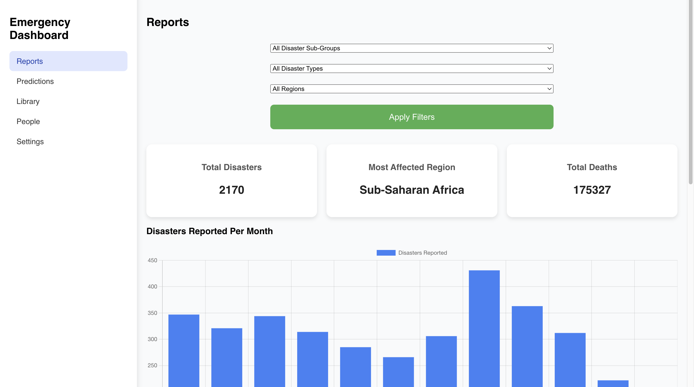

# CrisisAlert-Analytical-Dashboard
An analytics dashboard used to track and predict floods and natural disasters in African regions, that can be used to  improve emergency preparedness and response coordination

